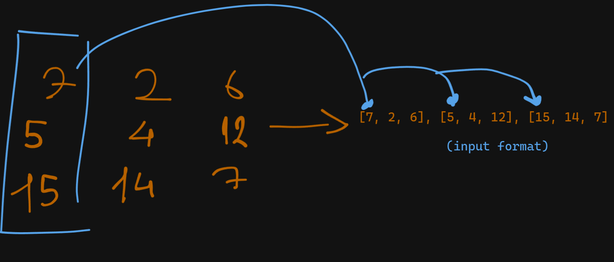

# The Game
Based on the [game](https://segmentle.com/). Each column should add up to the desired target number. That's all there is to it.

# Rearrange Grid to Match Column Sum Target
This repository contains Python code for the solve_grid() function which rearranges the numbers in a 2D grid. The primary objective of this function is to ensure the sum of numbers in each column equals a predefined target number.

# Description
The solve_grid() function takes a two-dimensional grid and a target sum as inputs. It rearranges the grids such that the sum of each column equals the target. The function uses permutation to achieve this: it iterates all permutations of the grid's numbers and checks if the columns' sum matches the target. If a permutation matches the criteria, it is reshaped back into a two-dimensional grid and returned. If no matching permutation is found, the function returns False.

The bulk of the function lies in finding all permutations of the grid's numbers. This is done with the itertools library's permutations function. The numpy library is used to reshape the matching permutation back into a two-dimensional grid.

# Input Format

